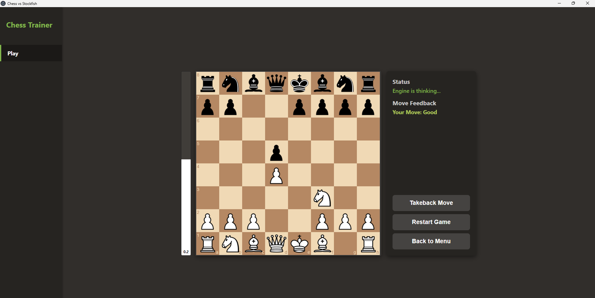
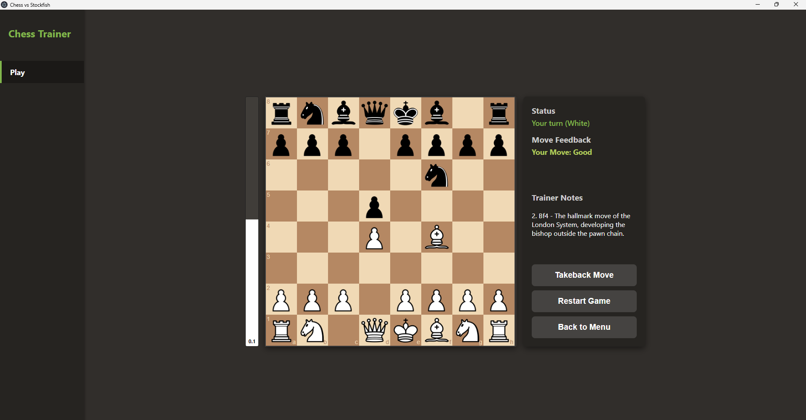

# ElectronChess

[](https://nodejs.org/)
[](https://www.electronjs.org/)
[](https://stockfishchess.org/)
[](LICENSE)
[](https://github.com/)

A desktop chess training application built with Electron, chessboard.js, and chess.js, powered by a native Stockfish chess engine.

The application features real-time evaluation analysis, automatic move classification, and an interactive opening theory trainer within a dark-themed interface.

---

## Features

- **Play vs Stockfish Engine**: Play against Stockfish running locally through the Universal Chess Interface (UCI) protocol.
- **Real-Time Advantage Bar**: Dynamic evaluation bar showing centipawn evaluations and mate distances.
- **Move Quality Feedback**: Instant evaluation differential categorization for each move:
  - Best / Excellent / Good
  - Inaccuracy
  - Mistake
  - Blunder / Miss
- **Opening Trainer**: Interactive move-by-move theory training with positional annotations and randomized opponent responses.
  - Included openings: London System and Italian Game.
  - Fully extensible via custom JSON definition files.
- **Move Takeback**: Revert moves at any stage of the game to explore alternative branches.
- **Cross-Platform Support**: Built for Windows with dedicated setup scripts for Linux distributions.
- **Repository-Safe Engine Distribution**: Includes compressed Stockfish storage (under 75 MB) to comply with GitHub's 100 MB per-file limit, with automatic decompression during installation.

---

## Screenshots

### Play vs Stockfish
Play white against Stockfish with live evaluation advantages and automated move quality rating feedback.



### Opening Trainer
Master key opening theory with step-by-step move annotations and randomized opponent responses.



---

## Prerequisites

- **Node.js**: Version 18.0.0 or higher
- **npm**: Version 8.0.0 or higher (distributed with Node.js)
- **Supported Operating Systems**:
  - Windows 10 / 11 (64-bit)
  - Linux (Ubuntu, Debian, Fedora, Arch Linux, etc.)

---

## Installation and Quick Start

### Windows

1. **Clone the repository:**
   ```bash
   git clone https://github.com/your-username/electron-chess.git
   cd electron-chess
   ```

2. **Install dependencies:**
   ```bash
   npm install
   ```
   *Note: During `npm install`, the postinstall script automatically extracts the bundled Stockfish binary (`stockfish.exe`) from `stockfish.zip`.*

3. **Start the application:**
   ```bash
   npm start
   ```
   *(On systems where PowerShell script execution is restricted, run `npm.cmd start` or double-click `run.bat`)*.

#### One-Click Launch (Windows)
Double-click `run.bat` in the project root. This launcher verifies Node.js, runs dependency installation if missing, unpacks the engine, and launches the application.

---

### Linux

1. **Clone the repository:**
   ```bash
   git clone https://github.com/your-username/electron-chess.git
   cd electron-chess
   ```

2. **Run the Linux setup script:**
   ```bash
   bash scripts/setup-linux.sh
   ```
   *This script verifies Node.js, detects or installs system Stockfish (via `apt`, `dnf`, `pacman`, or official GitHub releases), and completes `npm install`.*

3. **Start the application:**
   ```bash
   npm start
   ```
   *Alternatively, execute `./run.sh`.*

---

## Architecture

```
ElectronChess-repo/
├── assets/                  # Chess piece sprite assets (PNG)
├── docs/
│   └── images/              # Documentation screenshots
│       ├── vstockfish.png
│       └── trainer.png
├── openings/                # Opening theory database
│   ├── london.json          # London System lines and annotations
│   └── italian.json         # Italian Game lines and annotations
├── scripts/
│   ├── setup-stockfish.js   # Automated Stockfish extraction script (cross-platform)
│   └── setup-linux.sh       # Linux environment setup and engine linker
├── index.html               # Main dashboard and board interface
├── index.css                # Dark theme stylesheet
├── main.js                  # Electron main process and Stockfish UCI manager
├── preload.js               # Context-isolated secure IPC bridge
├── renderer.js              # Board controller, evaluation stream, and trainer logic
├── package.json             # NPM dependencies, scripts, and build metadata
├── run.bat                  # Windows batch launcher
├── run.sh                   # Linux/macOS shell launcher
├── stockfish.zip            # Compressed Stockfish binary (<100MB for GitHub)
└── .gitignore               # Excludes node_modules and uncompressed binaries
```

### Engine Communication Pipeline

1. **Process Management**: The main process (`main.js`) launches the Stockfish binary as a child process and initializes standard UCI mode (`uci`, `isready`). CPU thread and hash table allocations are capped to prevent CPU throttling on mobile processors.
2. **Synchronized Command Barrier**: All engine state transitions utilize the standard UCI `isready` / `readyok` synchronization barrier. Ongoing evaluations are halted and verified idle before new position analysis or move generation commands are dispatched.
3. **Move Requests**: On user move completion, `go movetime 1000` is dispatched, allocating 1 second of calculation before Stockfish replies with its `bestmove`. A safety timeout watchdog ensures the engine never hangs or locks the user interface.
4. **Graceful Shutdown**: On window closure, a `quit` command is sent to Stockfish standard input, terminating the engine cleanly without leaving orphaned background processes.

---

## Adding Custom Openings

To add a new opening variation to the trainer, create a JSON file inside the `openings/` directory following this format:

```json
{
  "name": "Your Opening Title",
  "color": "w",
  "lines": [
    {
      "name": "Main Line",
      "sequence": [
        { "move": "e2e4", "note": "1. e4 - Advance central king pawn." },
        { "move": "e7e5", "response": true },
        { "move": "g1f3", "note": "2. Nf3 - Develop knight attacking the central pawn." }
      ]
    }
  ]
}
```

- `move`: The move in coordinate algebraic notation (`source + target`, e.g. `e2e4`).
- `note`: Positional advice displayed to the player upon executing the move.
- `response: true`: Flags an opponent move that the trainer automatically plays in response.

Add a corresponding selection button in `index.html` within `#opening-list`:

```html
<button class="card-btn opening-btn" data-file="openings/your_opening.json">
    <h3>Your Opening Title</h3>
    <p>Brief summary of opening strategy and characteristics.</p>
</button>
```

---

## Packaging Standalone Distribution

To generate a standalone portable desktop executable for Windows:

```bash
npm run build
```

The output bundle will be generated in the `dist/` directory with all dependencies and resources pre-packaged.

---

## License

This software is released under the MIT License. See [LICENSE](LICENSE) for details. Stockfish is licensed under the GNU General Public License v3.0 (GPL-3.0).
